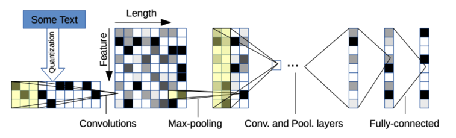

# Text-Classification

This repository is an implementation for text classification from character-level using convolutional networks following the research paper:
Xiang Zhang, Junbo Zhao, Yann LeCun. [Character-level Convolutional Networks for Text Classification](http://arxiv.org/abs/1509.01626). Advances in Neural Information Processing Systems 28 (NIPS 2015)

The dataset used is constructed by Xiang Zhang (xiang.zhang@nyu.edu) from the AG collection of news articles.
Link to AG collection : http://www.di.unipi.it/~gulli/AG_corpus_of_news_articles.html

The AG's news topic classification dataset is constructed by choosing 4 largest classes from the original corpus. Each class contains 30,000 training samples and 1,900 testing samples. The total number of training samples is 120,000 and testing 7,600.
The classes are: World, Sports, Business and Sci/Tech.

It is used as a text classification benchmark in the following paper: Xiang Zhang, Junbo Zhao, Yann LeCun. Character-level Convolutional Networks for Text Classification (arXiv:1509.01626v3),(http://arxiv.org/pdf/1509.01626v3.pdf).

A pictorial overview of the structure of the CNN is given below,

The Neural network is 9 layers deep with 6 convolutional
layers and 3 fully-connected layers. For more information, visit the links to the article provided above.

Dependencies:
* Python3
* Tensorflow
* NumPy
